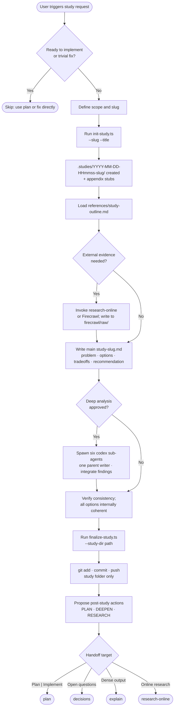

# study
Produce structured, evidence-backed technical studies and persist them in a dedicated `.studies/` workspace at the repository root. Use before implementation when architecture questions, option tradeoffs, or blast-radius analysis must be resolved first. Hands off to `plan`, `decisions`, or `research-online` after a study is complete.

## Install

The fastest cross-agent install path is the `skills` CLI:

```bash
npx skills add gg-skills/study
```

Drop this skill into a workspace as a Git submodule for pinned versions, or as a plain clone for latest `main`:

```bash
# Project-local, version-pinned:
git submodule add git@github.com:gg-skills/study.git .claude/skills/study

# OR project-local, latest main:
mkdir -p .claude/skills
git -C .claude/skills clone git@github.com:gg-skills/study.git

# OR user-level, available in every project on this machine:
mkdir -p ~/.claude/skills
git -C ~/.claude/skills clone git@github.com:gg-skills/study.git
```

Restart your agent or reload skills after installation. See the parent [`skills` catalog repo](https://github.com/gg-skills/skills) for the full catalog.

## When to use

- The user asks to **study, research, analyze, or evaluate** a technical decision before implementation.
- A Codex session inspection surfaced **unresolved workflow, heuristic, or architecture questions**.
- Evidence exists but the concrete change inventory, regression scope, or operator blast radius is still **fuzzy**.
- The user needs a **structured comparison of options** with tradeoffs and a recommendation.

Skip when the user is ready to implement (use `plan`), when the fix is trivial with no architectural uncertainty, or when the request is purely about writing specs without prior analysis.

## How it operates

### Inputs

| Input | Details |
|-------|---------|
| `--slug` flag | Short identifier for the study topic; normalized to lowercase-hyphenated form |
| `--title` flag | Human-readable title written into the main study file header |
| `--timestamp` flag | Optional override of the `YYYY-MM-DD-HHmmss` folder prefix (useful for pre-scheduled evidence capture) |
| `--study-dir` / `--latest` flag | Required by `finalize-study.ts` to identify which study folder to commit |
| `--commit-message` flag | Optional override of the default git commit message in `finalize-study.ts` |
| `--dry-run` flag | Supported by both scripts; prints actions without writing files or running git |
| `references/study-outline.md` | Authoritative section outline and open-question template; loaded by the agent at study start |
| `agents/codex-subagents/*.md` | Six prompt assets for optional deepening lanes; loaded only on explicit user approval |

### Outputs

| Artifact | Path | Format |
|----------|------|--------|
| Study workspace | `.studies/YYYY-MM-DD-HHmmss-<slug>/` | Folder |
| Main study | `.studies/…/study-<slug>.md` | Markdown |
| File inventory | `.studies/…/appendix-01-file-inventory.md` | Markdown stub |
| References | `.studies/…/appendix-02-references.md` | Markdown stub |
| Validation & tests | `.studies/…/appendix-03-validation-and-tests.md` | Markdown stub |
| Log excerpts | `.studies/…/appendix-04-log-excerpts.md` | Markdown stub |
| Charts & matrices | `.studies/…/appendix-05-charts-and-matrices.md` | Markdown stub |
| Firecrawl raw payloads | `.studies/…/firecrawl/raw/` | JSON/text (when used) |
| Firecrawl reports | `.studies/…/firecrawl/reports/` | Markdown (when used) |
| UI spec | `.studies/…/ui-spec/` | Markdown (when UI planning is in scope) |

Appendixes are optional; create only those that add value. Studies are **never** saved under `docs/`.

### External commands

| Command | When invoked |
|---------|-------------|
| `npx tsx .../init-study.ts --slug <slug> --title <title>` | At study start to scaffold the timestamped folder and appendix stubs |
| `npx tsx .../finalize-study.ts --study-dir <path>` | Immediately after study completion to stage, commit, and push the study folder |
| `git add`, `git commit`, `git push` | Called internally by `finalize-study.ts` via `child_process.execSync` |
| `research-online` / Firecrawl CLI | When external best-practice evidence is needed; raw payloads land in `firecrawl/raw/` |

### Side effects

- Creates a **new timestamped folder** under `.studies/` in the host repository on every `init-study.ts` run.
- **Commits and pushes** the study folder to the current branch (scoped to only study-folder files) when `finalize-study.ts` runs.
- `finalize-study.ts` **asserts a clean git index** before staging; any pre-existing staged changes must be committed or unstaged first.
- Slug collision (same timestamp + slug) raises an error; resolve with `--timestamp` override.

### Mode toggles

| Flag / condition | Effect |
|-----------------|--------|
| `--dry-run` | Both scripts print what they would do without writing files or touching git |
| Explicit user approval of deepening | Activates the six-lane Codex sub-agent pass (one parent writer, six disjoint child roles) |
| `--latest` on `finalize-study.ts` | Auto-resolves to the most-recently-created folder under `.studies/` |

## Operational flow



## Layout

```
study/
├── SKILL.md                          # Skill descriptor loaded by Claude Code
├── README.md                         # This file
├── references/
│   └── study-outline.md              # Section outline + open-question template
├── scripts/
│   ├── init-study.ts                 # Scaffold a new .studies/ folder
│   ├── finalize-study.ts             # Stage, commit, and push a completed study
│   └── openai.yaml                   # OpenAI-compatible agent spec (optional)
├── agents/
│   └── codex-subagents/
│       ├── codepath-cartographer.md
│       ├── runtime-contract-auditor.md
│       ├── implementation-change-auditor.md
│       ├── regression-strategy-auditor.md
│       ├── operator-surface-auditor.md
│       └── documentation-workflow-auditor.md
└── assets/
    ├── icon-large.png / icon-large.svg
    ├── icon-master.png
    └── icon-small.svg
```

## Quick start

```bash
# 1. Scaffold a new study
npx tsx .claude/skills/study/scripts/init-study.ts \
  --slug "auth-strategy" --title "Auth Strategy Evaluation"

# 2. Write the study (agent fills study-auth-strategy.md from the outline)

# 3. Commit and push
npx tsx .claude/skills/study/scripts/finalize-study.ts \
  --study-dir ".studies/$(ls .studies/ | sort | tail -1)"

# Dry-run either script without side effects
npx tsx .claude/skills/study/scripts/init-study.ts \
  --slug "test" --title "Test" --dry-run
```

## Resources

- `references/study-outline.md` — canonical section template and open-question format
- `agents/codex-subagents/` — six deepening-lane prompt assets
- [SKILL.md](SKILL.md) — full skill descriptor, non-negotiable policies, cross-skill handoff table, and troubleshooting guide
- Parent collection: [gg-skills/skills](https://github.com/gg-skills/skills)

## Caveats

- Studies **must** go under `.studies/`, never `docs/`. The finalize script scopes its commit to the study folder only; unrelated staged changes will cause it to abort.
- Planning via `plan` is **mandatory** before implementation; this skill explicitly blocks the jump from study to code.
- The six-lane Codex sub-agent deepening pass is **opt-in** and requires explicit user approval each time.
- `init-study.ts` uses the **host timezone** for the timestamp prefix — verify if reproducible folder names across CI and developer machines matter for your workflow.
- Any claims about external tool versions, model pricing, or API specifics bundled in `references/` may be stale; verify with `research-online` before acting on them.
